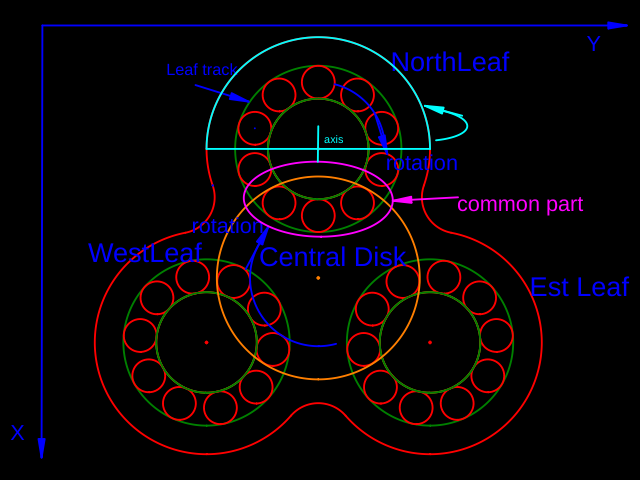
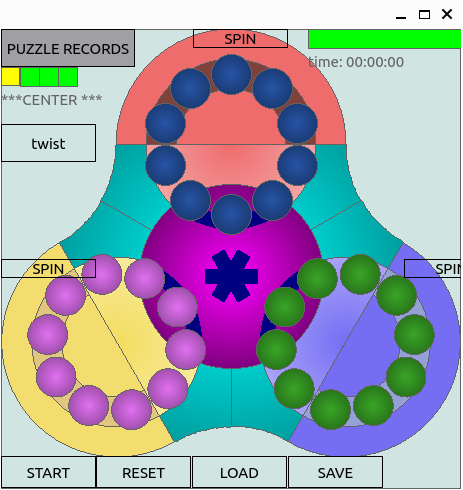

# SpinPuzzle

**SpinPuzzle** is a strategic solitaire game played on a unique board where the objective is to group a set of marbles according to their colors.

## Game Objective and Structure

### Board

The game is played on a board with a Trefoil shape, utilizing both sides.

The board consists of a central disk (referred to as *CentralDisk*) and three leaves (*NorthLeaf*, *WestLeaf*, and *EastLeaf*). Refer to the [Game Schema](./images/spin_puzzle.png) for visualization.



### Moves

On this board, players interact with 60 marbles of six different colors (10 marbles per color) distributed evenly across the two sides of the Trefoil.

The marbles are confined to various guides/rails:
- Each leaf contains a circular track where marbles can be moved (green in the [Game Schema](./images/spin_puzzle.png)).
- The *CentralDisk* can rotate around its axis (orange in the [Game Schema](./images/spin_puzzle.png)).
- Each leaf and the central disk share a common section of the tracks, allowing marbles to be transported between leaves (magenta in the [Game Schema](./images/spin_puzzle.png)).
- The upper part of the leaf can rotate around its x-axis (parallel to the X axis), allowing for mixing marbles from different sides of the Trefoil (cyan in the [Game Schema](./images/spin_puzzle.png)).

## QSpinPuzzle

### Getting Started

- Launch the executable `QSpinPuzzle`.
  - If using the Python version, execute:
    ```
    python -m qspyn_puzzle 
    ```
  **Note:** The Python version is located in the `appy` directory.
- Press `shuffle`.
- Attempt to restore the marbles to their original positions, where each leaf contains marbles of only one color.

Upon launching the game, the front Trefoil is displayed.



- You can move marbles using the mouse by dragging them or by using the keyboard:
  - Select the component to operate on by pressing:
    - `N`: North leaf
    - `E`: East leaf
    - `W`: West leaf
    - `I`: Internal circle
  - Rotate the marbles using the arrow keys.
  - Check the selected component in the status on the left corner (`KB: <status>`).
- Press the "twist" button (top left) or the `P` key to change the active side.
- Spin a leaf by pressing the corresponding button on the leaf or selecting the leaf with the keyboard and pressing `PageUp` or `PageDown`.
- Press `shuffle` to randomize the marbles with 10,000 random operations.
- Use `reset` to reorder the marbles to their original configuration.

### Installation

To build this project, you need:
- `cmake` (version 3.5 or higher)
- A C++ compiler (C++ standard 17)
  - Tested with `g++ (Ubuntu 11.4.0-1ubuntu1~22.04) 11.4.0`
- `ninja` to build the corresponding Python package `spyn_puzzle`
- Optional: Qt library
  - If you have Qt libraries, use the argument `-D USE_QT=yes` when configuring with CMake.
  - If `cmake` cannot find the Qt libraries, manually set the Qt installation directory in the `CMakeLists.txt` file.
- `pyside6` to run the UI with Python:
         `pip install pyside6` 

For example, this should lunch the game:

```
git clone https://github.com/StefanoBelloni/QSpinPuzzle.git
git submodule update --init
cd QSpinPuzzle

python3 -m venv ./venv
source venv/bin/activate

pip install packages/spinbind11_puzzle
pip install packages/spyn_puzzle
pip install packages/qappy

python -m qspyn_puzzle
```

### Implementation

The implementation is straightforward:
- The UI is a QWidget that paints the Trefoil inside a QWindow.
- The game logic is implemented in `puzzle::SpinPuzzleGame`, consisting of two sides of `puzzle::SpinPuzzleSide`.
- Only one side is active at a time, and users can manipulate marbles, the internal disk, or spin the leaves using the provided API from `puzzle::SpinPuzzleGame`.
- Use iterators from `puzzle::SpinPuzzleSide` to iterate through the marbles:
- For leaves (NORTH, EAST, WEST), circularly iterate through the marbles inside a leaf.
- For `puzzle::LEAF::TREFOIL`, the iterator starts from the Trefoil origin and iterates through all the marbles in sequence.
- Various operation tests can be found in the `tests` directory.

## Dependencies

- The UI of the application requires Qt (version 6).
- Qt library (Qt6) or `pip install pyside6`.
- Refer to [Qt's open-source LGPL obligations](https://www.qt.io/licensing/open-source-lgpl-obligations).
- This project is licensed under GPL-3.0.
- To generate coverage results, `gcov` and `lcov` are required:

```
apt install lcov
```

- Use Doxygen for a comprehensive overview of the implementation.
- To build the Python package, `pybind11` is required:

```
git submodule add -b stable ../../pybind/pybind11 extern/pybind11
git submodule update --init
```

## Trubleshooting

### Windows

There have been some difficulties to run the applications on Windows.
After some attempts, the following seems to work:

* Install [WSYS2](https://www.msys2.org/) along with `gcc`, `cmake` and `ninja`
  - `pacman -S mingw-w64-ucrt-x86_64-gcc`
  - `pacman -S mingw-w64-ucrt-x86_64-cmake`
  - `pacman -S mingw-w64-ucrt-x86_64-ninja`

* Add the installation location of `MingW64` (most likely `C:\msys64\mingw64\bin`) to
   - `PATH` enviromental variable
   - `PYTHONPATH` enviromental variable
   
   **NOTE**: this is needed since on Windows the DLL
      are no longer searched in `PATH` but have to be explicitly added via
      `os.add_dll_directory`[see](https://github.com/pytest-dev/pytest/discussions/10692)
      The package `packages/spyn_puzzle/spyn_puzzle` is there for this reason:
      It adds the subpath from `PYTHONPATH` to `add_dll_directory`.

* run the script `scripts/compile_win.ps1`

It should lunch at the very end the `QSpinPuzzleGame`.

**NOTE** when you need to decide where to clone the repository in Windows,
it might be better to have a _short path_, since longer path might create
problem when compiling, due to the limit of the maximum length of _paths_

## TODOs

- [ ] Add a button to check if the game has been solved.
- [ ] Change leaf color when spinning a leaf.
- [ ] ...

### References

(1): [Trefoil](https://en.wikipedia.org/wiki/Trefoil)
